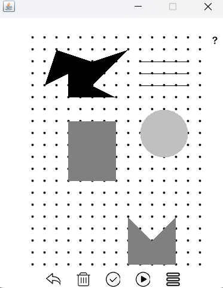
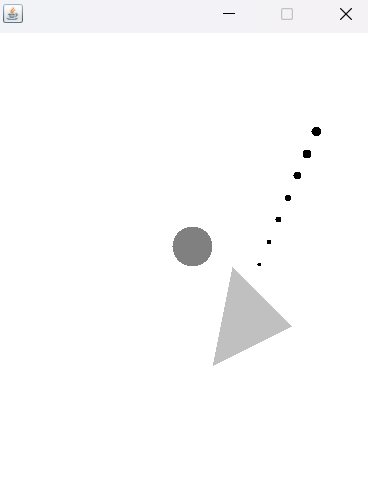

# okay（画线弹射游戏）
> 本项目为个人在初学 Java 时，用 Swing 这个老旧技术简单实现的游戏。模仿的是 okay? app  

**【未完成，还差小球撞击反弹判断】**  
[算法说明](./okay/src/main/resources/okay算法说明.pdf)  
[游戏玩法说明](https://github.com/xuyj1111/game/blob/master/okay/src/main/resources/file/desc.md)  


## 开发环境
- Intellij IDEA
- Java SE
- MySQL

## 项目文件
- constant：常量类
- dto：对象
- entity：实体类，对应数据库表
- enums：枚举类
- jdbc：简单封装了jdbc（新手时期没学持久化框架）
- job：定时任务
- page：游戏的界面
    - admin：管理员界面
    - base：构建界面的自定义基础类
    - defined：自定义关卡界面（绘图板）
    - init：初始界面
    - listener：全局监听类
    - login：登陆界面
    - play：游戏界面（或预览）
    - register：注册界面
    - user：用户界面
- util：工具类
    - BeanFactory：放了一堆静态类
    - DrawBoardUtil：绘图板工具类
    - RayCasUtil：射线法实现工具类（用于判断各种图形重合）

## 表结构
user（用户表）

| 序号  | 名称  | 类型  | 描述  | 键   | 为空  | 额外  | 默认值 |
| --- | --- | --- | --- | --- | --- | --- | --- |
| 1   | id  | bigint(20) | 主键  | PRI | NO  | auto_increment |     |
| 2   | name | varchar(255) | 用户名 |     | NO  |     |     |
| 3   | pwd | varchar(255) | 密码  |     | NO  |     |     |
| 4   | record | int(11) | 闯关纪录 |     | NO  |     | 1   |

level（关卡表）

| 序号  | 名称  | 类型  | 描述  | 键   | 为空  | 额外  | 默认值 |
| --- | --- | --- | --- | --- | --- | --- | --- |
| 1   | id  | bigint(20) | 主键  | PRI | NO  | auto_increment |     |
| 2   | level_id | bigint(20) | 关卡序号 |     | NO  |     |     |
| 3   | name | varchar(255) | 关卡名 |     | NO  |     |     |
| 4   | map | longtext | 地图  |     | NO  |     |     |
| 5   | user | varchar(255) | 使用者 |     | NO  |     |     |
| 6   | is_system | tinyint(1) | 是否系统，0否1是 |     | NO  |     |     |

map格式
- type:
    - line-线
    - circle-圆
    - polygon-多边形
- property:
    - elimination-单次消除（灰色）
    - double_elimination-双次消除（浅灰）
    - obstacle-障碍（黑色）
    - black_hole-黑洞（空心）
- point：
    - number: 序号
    - x、y: 坐标【**本游戏中的坐标系，X轴正常，Y轴****相反****，即左上角为(0, 0)**】

```json
[
  {
    "type":"POLYGON",
    "property":"ELIMINATION",
    "point":[
      {
        "number":0,
        "x":6,
        "y":9
      },
      {
        "number":1,
        "x":5,
        "y":11
      },
      {
        "number":2,
        "x":10,
        "y":8
      },
      {
        "number":3,
        "x":6,
        "y":9
      }
    ]
  }
]
```
# 下一个游戏
> 功能未定，时间未定
