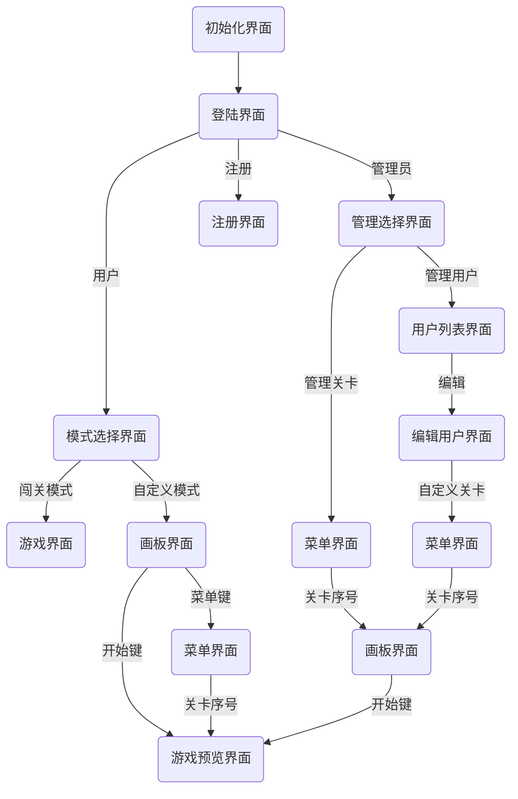

# okay?（画线弹射）游戏介绍

## 界面简介

- 初始界面：游戏启动后显示的界面，在界面的任意处点击，显示文字 “Let's start...”，再次界面的任意处点击，进入登陆界面
- 登陆界面：
  - 点击右上角的 “?”，可弹出此说明文档（在此后的用户界面皆有）
  - 点击 “注册”，进入注册界面
  - 输入对应的用户名和密码，点击人像图标，进入游戏（根据用户和管理员，分别进入不同的界面）
- 注册界面：输入对应的用户名和密码，点击 “✓” 即确定键，或 “✕” 即取消键
  - 若注册用户在系统中存在，则弹窗提醒 “该用户已存在”
  - 菜鸡系统只允许 18 个玩家，第 19 个注册弹窗提醒 “用户已满，不可注册”
- 模式选择界面：
  - 闯关模式：自动进行预设的 20 关关卡
  - 自定义模式：用户自定义的创建关卡，进行游戏
- 管理选择界面：
  - 管理关卡：对用户闯关的关卡进行修改设置
  - 管理用户：对用户进行 “注销” 和 “编辑” 操作

## 流程图

 

## 画板界面

1. 创建图形

   > 在画板中点击 1 个点，点会以方框形式表示选中，再次点击同 1 点取消选中；若点击空白处，会取消当前构建的图形；若 '正在构建的图形' 覆盖 '已构建的图形'，则取消当前构建的图形。
   >
   > 图形属性：单次消除（灰色）、双次消除（浅灰）、障碍（黑色）、黑洞（空心）。

   1. 圆形：双击创建，左键图形设置属性，右键图形设置大小
   2. 多边形：单击构线创建，左键图形设置属性
   3. 线：单击构线创建，第三下和第二下点击同一个位置。

2. 按键
   1. 底下的按键分别为 “返回”、“删除”、“确定”、“开始”、“菜单”。
   2. “返回” 键，返回之前选择关卡界面。
   3. “删除” 键，滑轮点击选中图形，再点击 “删除” 即可删掉图形（不能删除线）。
   4. “确定” 键，保存界面为用户自定义的一关。
   5. “开始” 键，预览当前绘图板，进行游戏（不保存）。
   6. “菜单” 键，进入自定义菜单界面。

## 游戏界面

- 按住左键，拖动鼠标选择方向发射小球
- 右键，按出“返回”键、“菜单”键
- 当消除所有需要消除的图形、线，通过关卡
